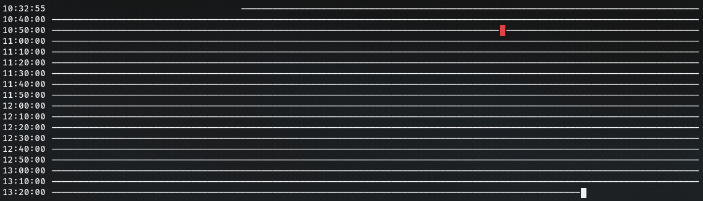

# Clog D

[](https://deno.land/)


Felt like making a CLI internet connectivity visualizer in **Deno**.

Unfortunately, Deno can't do ICMP, so I can't really _ping_ anything. And I didn't want to bother with calling the system level Ping this time (I have [Clog C](https://github.com/5310/clogc) for that), so this just uses [deno.land/x/online](https://deno.land/x/online) which polls Apple's much abused captive portal detector to check connectivity.

But it's good enough for me. I don't really need ping latency visualization or anything, just an at-a-glance yes-or-no ticker.



Usage:
```sh
  clogd [--period=PERIOD] [--timestamp=TIMESTAMP]
```

- `PERIOD`: Seconds between ping attempts
- `TIMESTAMP`: Minutes between timestamps